# __Qu'est-ce que notre Site ?__
C'est une site internet crée dans le cadre d'un Projet S2 de ma formation en DUT Informatique.

On retrouve sur ce site un jeu qui consiste à répondre à des questions dans une limite de temps.
Il a pour but d'améliorer votre culture générale.
Ces questions peuvent apparaître sous plusieurs formes (Texte avec image optionnelle) et on peut y répondre de plusieurs manières selon le type de la question (Choix simple/multiple, Écrire la réponse) et une fois la question répondu la réponse vous est donnée avec une explication optionnelle sur la réponse.
Pour ne pas s'ennuyer, le site propose deux modes de jeu :
➤ Mode général :
Des questions choisies aléatoirement apparaissent à l'écran, vous pouvez donc les enchaîner facilement.

➤ Mode ligue :
Ce mode n'est seulement accessible une fois que le joueur est connecté à un compte. Ce compte dispose d'informations sur les points du joueur, cela va donc définir la difficulté de la question qui va apparaître (Plus on a de points, plus les questions sont difficiles).
Lorsque le joueur répond correctement, il va gagner un point mais au contraire si il ne répond pas correctement alors il perdra un point.
Ce mode ligue permet donc d'établir un classement des joueurs ayant le plus de points pour avoir une partie "compétitive" pour palier à l'ennui !

# Video montrant les fonctionnalités du site

# Si vous n'aimez pas les vidéos, voici des images illustrant le site :
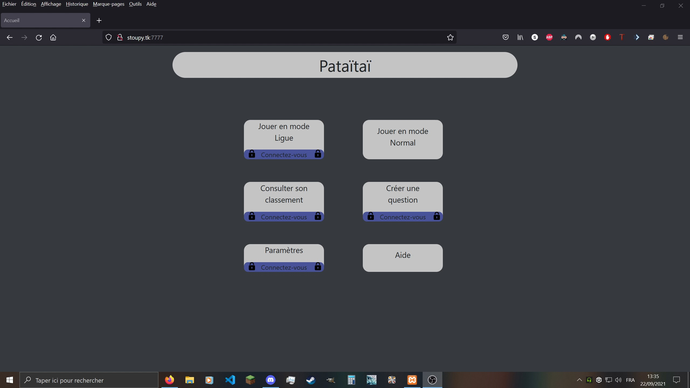
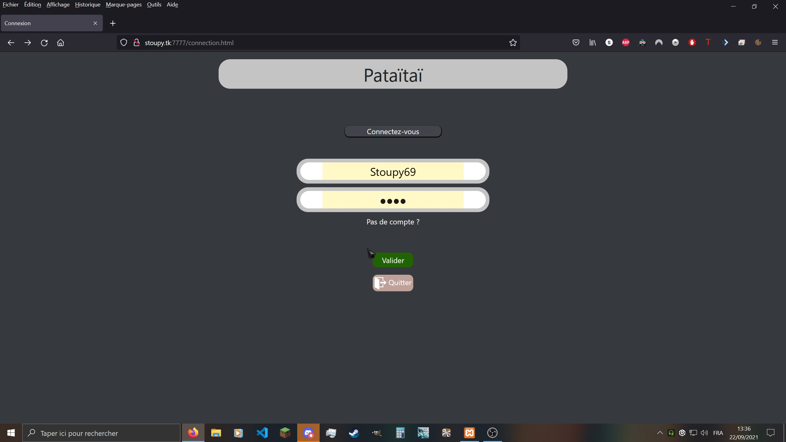
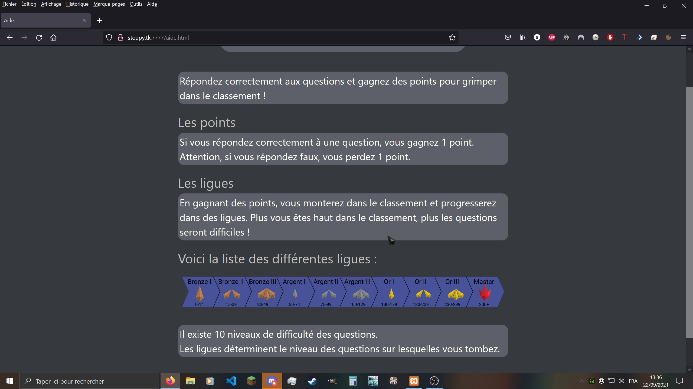
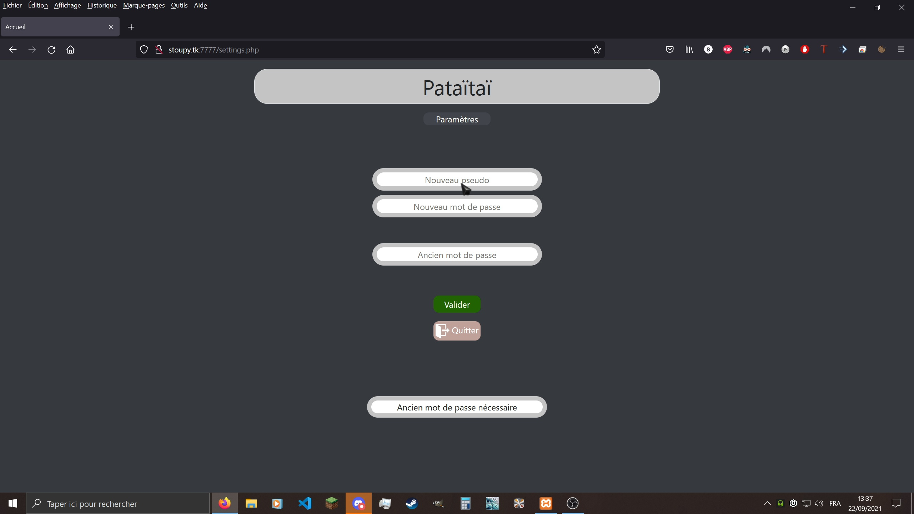
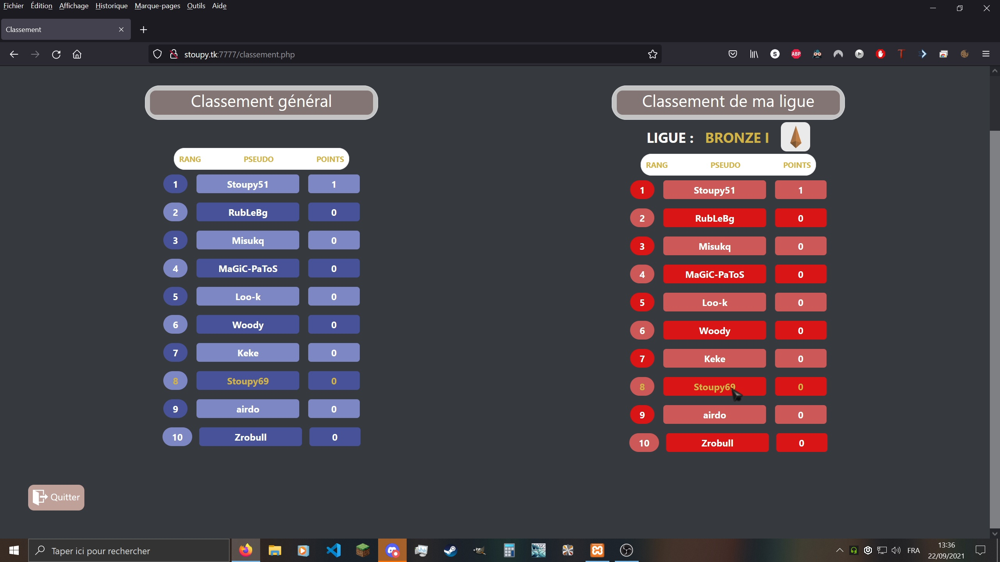
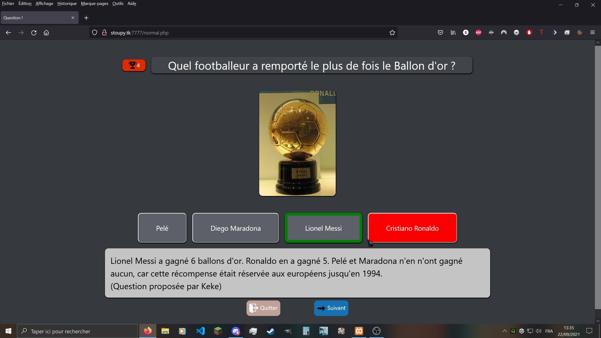
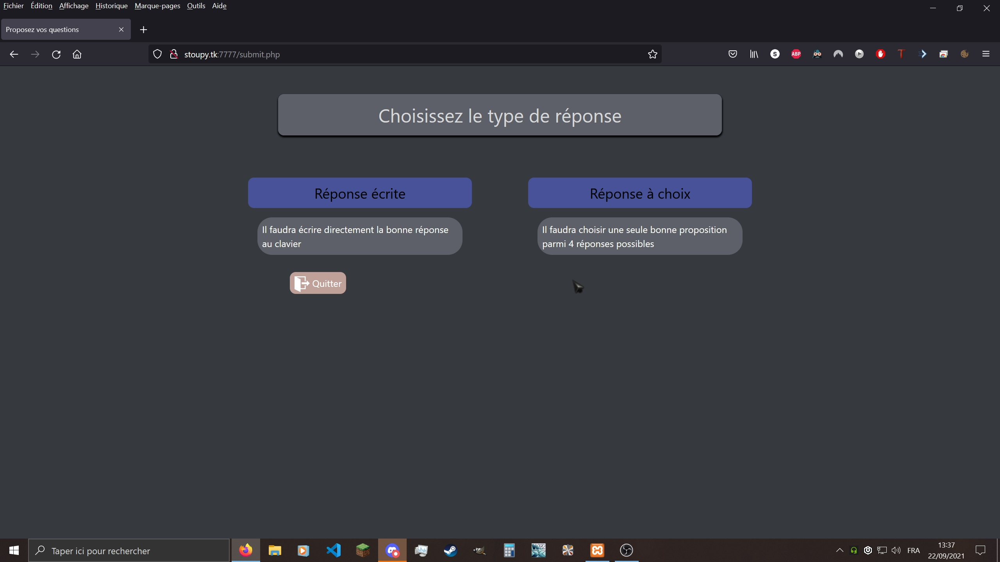
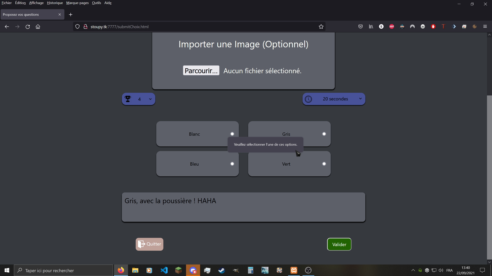

# Affichage pour les modérateurs :
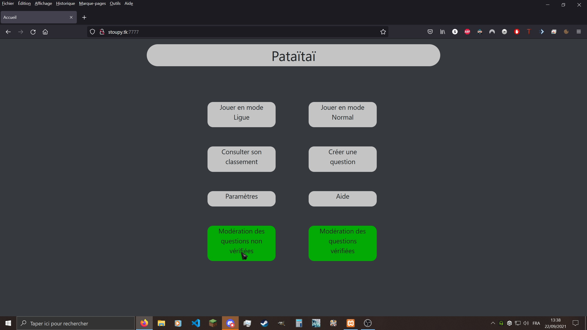
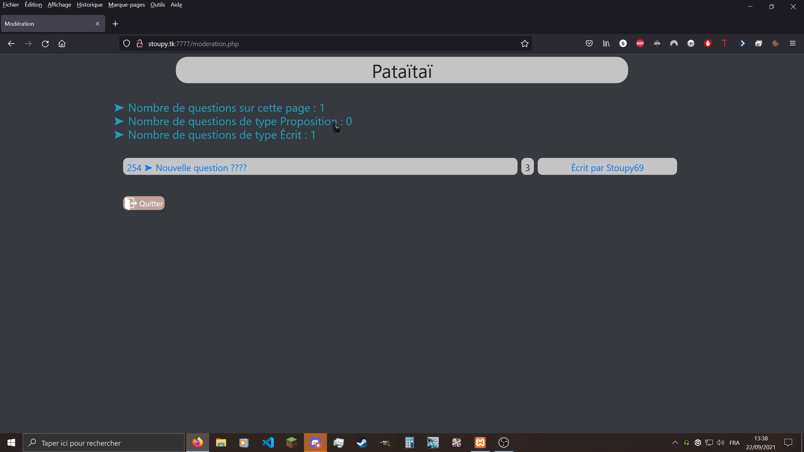
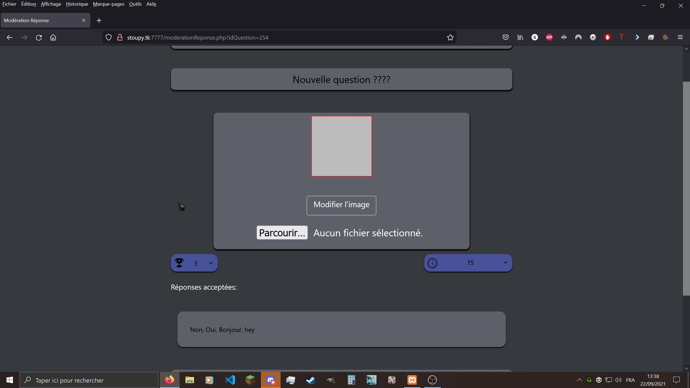
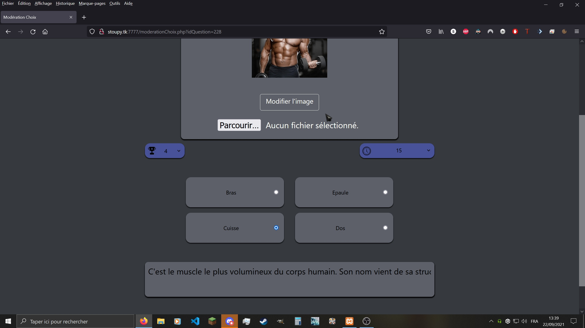
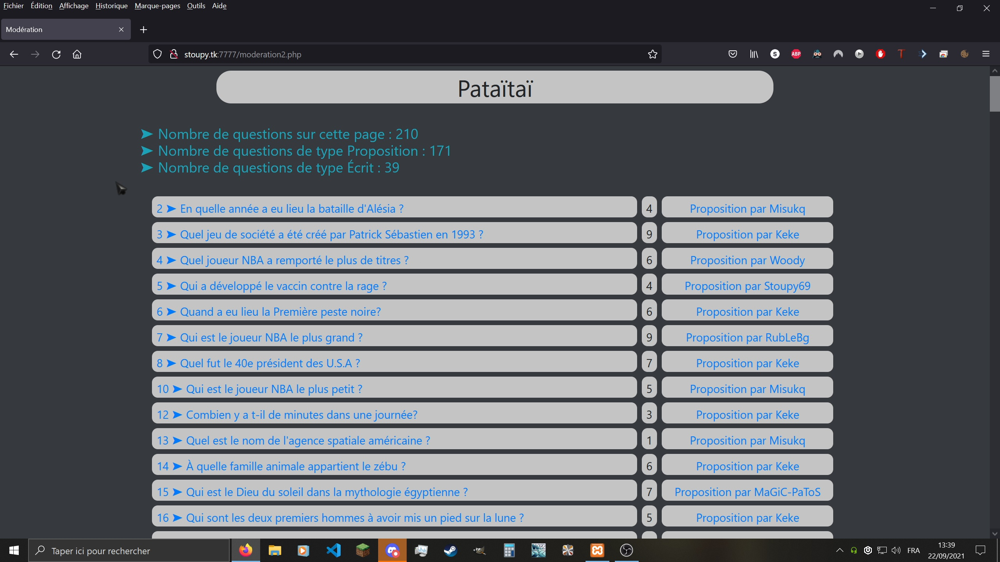
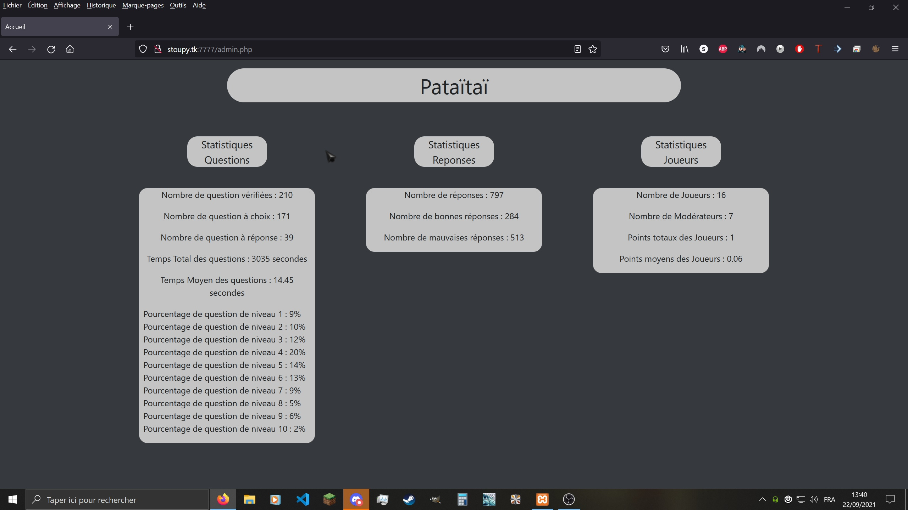
